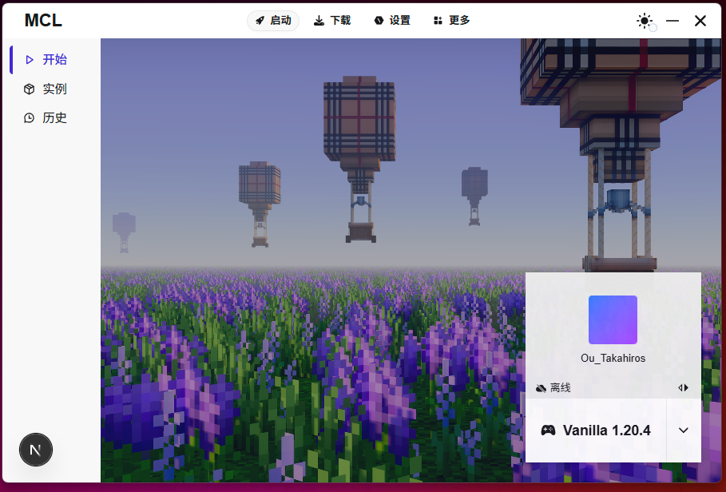
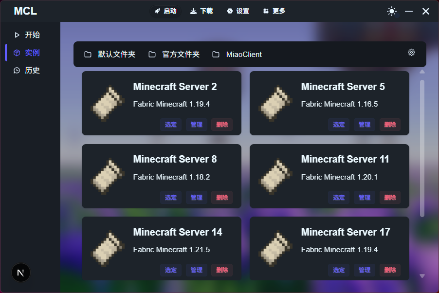
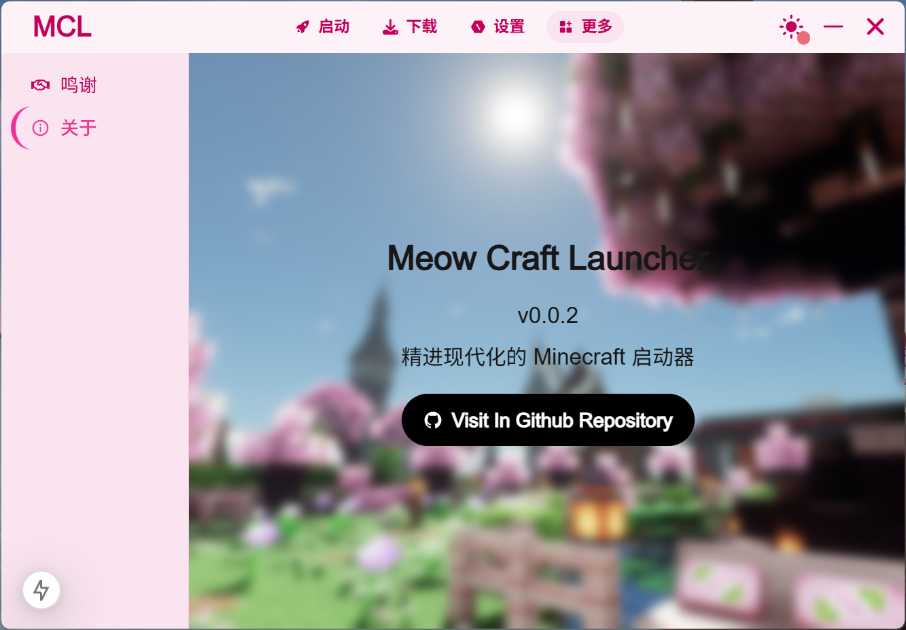

> **⚠️ 注意：** 本项目目前处于初期制作阶段，任何功能不稳定且不可用。

# 🐱 Meow Craft Launcher

  <h3>精进现代化的 Minecraft 启动器</h3>

  
  
  

Meow Craft Launcher (MCL) 是一款基于 Tauri 开发的现代化 Minecraft 启动器，专注于提供流畅、高效且美观的游戏启动体验。

## 🖼️ 界面预览

### 主界面 - 启动中心

在这里管理您的账户和选择游戏实例，一键启动 Minecraft。

### 实例管理

轻松管理多个 Minecraft 服务器和客户端实例。

### 关于页面

关于 Meow Craft Launcher 的详细信息。

## 💻 技术栈

- **框架**: Tauri + React/Next.js
- **UI**: TailwindCSS + DaisyUI
- **语言**: TypeScript, Rust

## 🙏 鸣谢

- [Tauri](https://tauri.app/) - 提供高效的桌面应用框架
- [Mojang](https://www.minecraft.net/) - 感谢创造了 Minecraft 这款伟大的游戏
- [NextJS](https://nextjs.org/) - 提供现代化的 React 框架
- [PCL2](https://github.com/Hex-Dragon/PCL2) - 从 Plain Craft LauncherL 启动器 得到 UI 设计思路
- [TRMCL](https://github.com/teaching-rust-minecraft-client-launcher) - rust minecraft launcher untils support

## 📜 MIT License

Copyright (c) 2025 LING

Permission is hereby granted, free of charge, to any person obtaining a copy
of this software and associated documentation files (the "Software"), to deal
in the Software without restriction, including without limitation the rights
to use, copy, modify, merge, publish, distribute, sublicense, and/or sell
copies of the Software, and to permit persons to whom the Software is
furnished to do so, subject to the following conditions:

The above copyright notice and this permission notice shall be included in all
copies or substantial portions of the Software.

THE SOFTWARE IS PROVIDED "AS IS", WITHOUT WARRANTY OF ANY KIND, EXPRESS OR
IMPLIED, INCLUDING BUT NOT LIMITED TO THE WARRANTIES OF MERCHANTABILITY,
FITNESS FOR A PARTICULAR PURPOSE AND NONINFRINGEMENT. IN NO EVENT SHALL THE
AUTHORS OR COPYRIGHT HOLDERS BE LIABLE FOR ANY CLAIM, DAMAGES OR OTHER
LIABILITY, WHETHER IN AN ACTION OF CONTRACT, TORT OR OTHERWISE, ARISING FROM,
OUT OF OR IN CONNECTION WITH THE SOFTWARE OR THE USE OR OTHER DEALINGS IN THE
SOFTWARE.