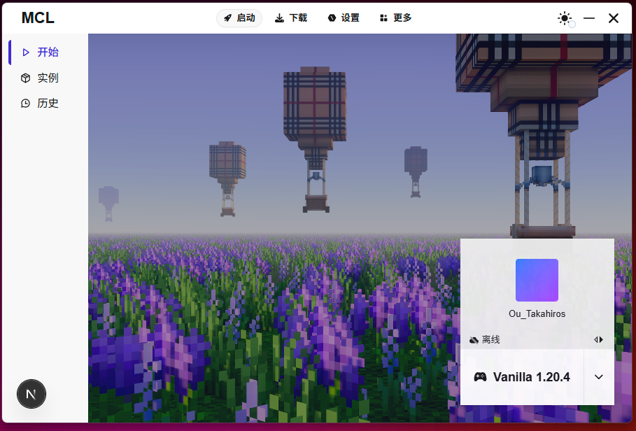
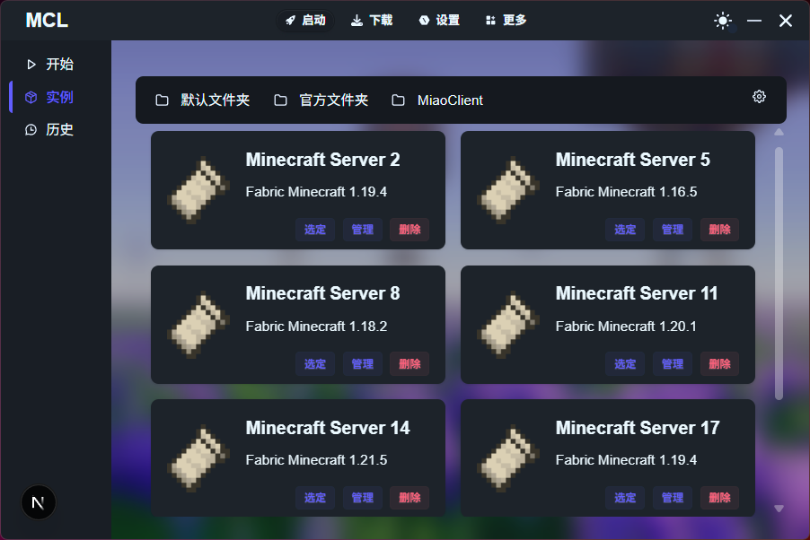
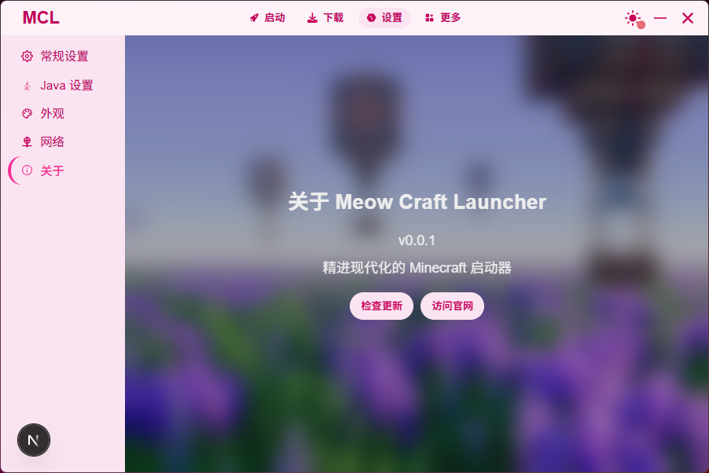

> **⚠️ 注意：** 本项目目前处于最初的UI制作阶段，还没有实现任何实际业务功能。界面展示仅为设计预览。

# 🐱 Meow Craft Launcher

<div align="center">

  <h3>精进现代化的 Minecraft 启动器</h3>

  
  
  
</div>

## ✨ 特色功能

Meow Craft Launcher (MCL) 是一款基于 Tauri 开发的现代化 Minecraft 启动器，专注于提供流畅、高效且美观的游戏启动体验。

- 🎮 **多版本支持** - 轻松管理不同版本的 Minecraft
- 🧩 **模组加载器集成** - 原生支持 Fabric、Forge 等多种模组加载器
- 🔄 **实例管理** - 创建、编辑和管理您的游戏实例
- 👤 **账户系统** - 支持 Microsoft 账户和离线模式
- 🌙 **多主题切换** - 多种精美主题，满足不同用户的审美需求
- ⚡ **高性能** - 基于 Tauri 构建，轻量级且启动迅速

## 🖼️ 界面预览

### 主界面 - 启动中心

在这里管理您的账户和选择游戏实例，一键启动 Minecraft。



### 实例管理

轻松管理多个 Minecraft 服务器和客户端实例。



### 关于页面

关于 Meow Craft Launcher 的详细信息。



## 💻 技术栈

- **框架**: Tauri + React/Next.js
- **UI**: TailwindCSS + DaisyUI
- **语言**: TypeScript, Rust

## 🚀 安装与使用

### 从源码构建

1. 克隆仓库
```bash
git clone https://github.com/your-username/mcl.git
cd mcl
```

2. 安装依赖
```bash
npm install
```

3. 开发模式运行
```bash
npm run tauri dev
```

4. 构建发布版本
```bash
npm run tauri build
```

## 📜 开源协议

本项目采用 [MIT 许可证](LICENSE)。

## 🙏 鸣谢

- [Tauri](https://tauri.app/) - 提供高效的桌面应用框架
- [Mojang](https://www.minecraft.net/) - 感谢创造了 Minecraft 这款伟大的游戏
- [NextJS](https://nextjs.org/) - 提供现代化的 React 框架
- [PCL2](https://github.com/Hex-Dragon/PCL2) - 从 Plain Craft LauncherL 启动器 得到 UI 设计思路
